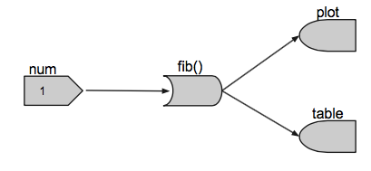
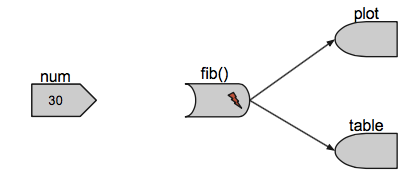
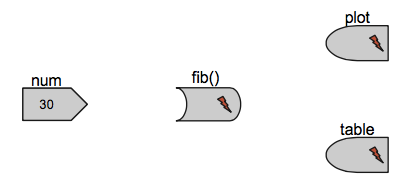

## Disclaimer

1. I am an autodidact 
2. What I present here works for me
3. Read and follow the official [shiny tutorial](http://rstudio.github.io/shiny/tutorial/) for the truth
4. Sometimes you have re-load this presentation for the charts to appear

--- .class #id 

## Introduction of shiny

* R Package shiny from RStudio supplies:
  * interactive web application  / dynamic HTML-Pages with plain R
  * GUI for own needs
  * Website as server

---

## What makes shiny special ?

* Very Simple: Ready to Use Components (widgets)
* event-driven (reactive programming): input <-> output
* communication bidirectional with web sockets (HTTP)
* JavaScript with JQuery (HTML) 
* CSS with bootstrap

---

## Getting started: Setup

1. ```R> install.packages("shiny")``` from CRAN
2. Create directory ```HelloShiny``` 
3. Edit ```global.r```
4. Edit ```ui.r```
5. Edit ```server.r```
6. ```R> shiny::runApp("HelloShiny")```

---

## Getting started: global.R

This file contains global variables, libraries etc.  [optional]


```r
## E.g.
library(googleVis)
The_Answer <- 42
```


---

## Getting started: server.R


The Core Component with functionality for input and output as plots, 
tables and plain text.


```r
shinyServer(function(input, output) {
       output$distPlot <- renderPlot({
         dist <- rnorm(input$obs)
         hist(dist)
         })
})
```


---

## Getting started: ui.R

This file creates the structure of HTML


```r
shinyUI(pageWithSidebar(
   headerPanel("Example Hello Shiny"),
   sidebarPanel(
      sliderInput("obs",  "", 0, 1000, 500)
   ),
   mainPanel(
      plotOutput("distPlot")
   )
))
```


---

## Getting strated: runApp

```R> shiny::runApp('HelloShiny')```

<iframe src="http://glimmer.rstudio.com/mages/HelloShiny/" width="100%" 
height="100%" frameborder="0">Loading</iframe>

---

## Select data for a scatter chart

<iframe src="http://glimmer.rstudio.com/mages/LancasterExample_1/" width="100%" 
height="100%" frameborder="0">Loading</iframe>


---

## Example 1: server.R


```r
# Contributed by Joe Cheng, February 2013 Requires googleVis version 0.4
# and shiny 0.4 or greater
library(googleVis)

shinyServer(function(input, output) {
    datasetInput <- reactive({
        switch(input$dataset, rock = rock, pressure = pressure, cars = cars)
    })
    output$view <- renderGvis({
        # instead of renderPlot
        gvisScatterChart(datasetInput(), options = list(width = 400, height = 400))
    })
})
```


---

## Example 1: ui.R


```r
shinyUI(pageWithSidebar(
  headerPanel("Example 1: scatter chart"),
  sidebarPanel(
    selectInput("dataset", "Choose a dataset:", 
                choices = c("rock", "pressure", "cars"))
  ),
  mainPanel(
    htmlOutput("view") ## not plotOut!
  )
))
```


---


## Interactive table

<iframe src="http://glimmer.rstudio.com/mages/LancasterExample_2/" width="100%" 
height="100%" frameborder="0">Loading</iframe>

---

## Example 2: server.R

```r
# Diego de Castillo, February 2013
library(datasets)
library(googleVis)
shinyServer(function(input, output) {
  myOptions <- reactive({
    list(
      page=ifelse(input$pageable==TRUE,'enable','disable'),
      pageSize=input$pagesize,
      height=400
    )
  })
  output$myTable <- renderGvis({
    gvisTable(Population[,1:5],options=myOptions())         
  })
})
```


---

## Example 2: ui.R


```r
shinyUI(pageWithSidebar(
  headerPanel("Example 2: pageable table"),
  sidebarPanel(
    checkboxInput(inputId = "pageable", label = "Pageable"),
    conditionalPanel("input.pageable==true",
                     numericInput(inputId = "pagesize",
                                  label = "Countries per page",10))    
  ),
  mainPanel(
    htmlOutput("myTable")
  )
))
```


---

## Animated geo chart

<iframe src="http://glimmer.rstudio.com/mages/LancasterExample_3/" width="100%" 
height="100%" frameborder="0">Loading</iframe>

---

## Example 3: loaddata.R


```r
## Markus Gesmann, February 2013
## Prepare data to be displayed
## Load presidential election data by state from 1932 - 2012
url <- paste0("http://www.google.com/fusiontables/api/query?",
              "sql=SELECT+*+FROM+1RPEUiwiM092IxMew7LhzEmMDvqPomAA7kqK1qa4")

dat <- read.csv(url, stringsAsFactors=TRUE)

## Add min and max values to the data
datminmax = data.frame(state=rep(c("Min", "Max"),21), 
                       demVote=rep(c(0, 100),21),
                       year=sort(rep(seq(1932,2012,4),2)))
dat <- rbind(dat[,1:3], datminmax)
require(googleVis)
```


---

## Example 3: server.R

```r
source('loaddata.R', local=TRUE)
shinyServer(function(input, output) {
  myYear <- reactive({
    input$Year
  })
  output$year <- renderText({
    paste("Democratic share of the presidential vote in", myYear())
  })
  output$gvis <- renderGvis({
    myData <- subset(dat, (year > (myYear()-1)) & (year < (myYear()+1)))
    gvisGeoChart(myData,
                 locationvar="state", colorvar="demVote",
                 options=list(region="US", displayMode="regions", 
                              resolution="provinces",
                              width=400, height=380,
                              colorAxis="{colors:['#FFFFFF', '#0000FF']}"
                 ))     
    })
})
```


---

## Example 3: ui.R


```r
require(shiny)
shinyUI(pageWithSidebar(
  headerPanel("Example 3: animated geo chart"),
  sidebarPanel(
    sliderInput("Year", "Election year to be displayed:", 
                min=1932, max=2012, value=2012,  step=4,
                format="###0",animate=TRUE)
  ),
  mainPanel(
    h3(textOutput("year")), 
    htmlOutput("gvis")
  )
))
```


---

## googleVis with interaction

<iframe src="http://glimmer.rstudio.com/mages/Interaction/" width="100%" 
height="100%" frameborder="0">Loading</iframe>


---

## Example 4: server.R / part 1


```r
require(googleVis)
shinyServer(function(input, output) {
  datasetInput <- reactive({
    switch(input$dataset, "pressure" = pressure, "cars" = cars)
  })
  output$view <- renderGvis({    
    jscode <- "var sel = chart.getSelection();
    var row = sel[0].row;
    var text = data.getValue(row, 1);               
    $('input#selected').val(text);
    $('input#selected').trigger('change');"    
    gvisScatterChart(data.frame(datasetInput()),
                     options=list(gvis.listener.jscode=jscode,
                                  height=200, width=300))
    
  })
```


---

## Example 4: server.R / part 2


```r
  output$distPlot <- renderPlot({
    if (is.null(input$selected))
      return(NULL)
    
    dist <- rnorm(input$selected)
    hist(dist,main=input$selected)
  })
  
  output$selectedOut <- renderUI({
    textInput("selected", "", value="10")
  })
  outputOptions(output, "selectedOut", suspendWhenHidden=FALSE)   
})
```


---

## Example 4: ui.R


```r
require(googleVis)
shinyUI(pageWithSidebar(
  headerPanel("", windowTitle="Example googleVis with interaction"),
  sidebarPanel(
    tags$head(tags$style(type='text/css', "#selected{ display: none; }")),
    selectInput("dataset", "Choose a dataset:", 
                choices = c("pressure", "cars")),
    uiOutput("selectedOut")
  ),
  mainPanel(
    tabsetPanel(
      tabPanel("Main",
               htmlOutput("view"),
               plotOutput("distPlot", width="300px", height="200px")),
      tabPanel("About", includeMarkdown('README.md')
      ))))
)
```


---

## Reactive model

Three objects build the framework:

* reactive source     [form input] 

* reactive conductor  [db-connect / calculate]

* reactive endpoint    [plot/table]

---

## Reactive model




---

## Reactive model



---

## Reactive model



---

## Further reading and examples

* [Shiny by RStudio](http://www.rstudio.com/shiny/)
* [First steps with googleVis on shiny](http://lamages.blogspot.co.uk/2013/02/first-steps-of-using-googlevis-on-shiny.html)
* [RStudio Glimmer Server](http://glimmer.rstudio.com:8787)
* [BI Dashbord with shiny and rCharts](http://glimmer.rstudio.com/reinholdsson/shiny-dashboard/)
* [Shiny examples with slidify](https://github.com/ramnathv/shinyExamples)
* [Shiny on R-Bloggers](http://www.r-bloggers.com/?s=shiny)


--- 

## The End. So what ...? 

* Shiny makes it easy to build interactive applications with R
* googleVis plots be as easily integrated as other static plots
* No more boring data

---

## How I created these slides


```r
library(slidify)
setwd("~/Dropbox/Lancaster/")
author("GoogleVis_on_shiny")
## Edit the file index.Rmd file and then
slidify("index.Rmd")
```


----

## Contact

* Markus Gesmann
* [markus.gesmann gmail.com](mailto:markus.gesmann@gmail.com)
* My blog: [http://lamages.blogspot.com](http://lamages.blogspot.com)

---

## Session Info

```r
sessionInfo()
```

```
## R version 3.0.1 (2013-05-16)
## Platform: x86_64-apple-darwin10.8.0 (64-bit)
## 
## locale:
## [1] de_DE.UTF-8/de_DE.UTF-8/de_DE.UTF-8/C/de_DE.UTF-8/de_DE.UTF-8
## 
## attached base packages:
## [1] stats     graphics  grDevices utils     datasets  methods   base     
## 
## other attached packages:
## [1] slidify_0.3.3 knitr_1.2    
## 
## loaded via a namespace (and not attached):
## [1] digest_0.6.3   evaluate_0.4.3 formatR_0.7    markdown_0.5.5
## [5] stringr_0.6.2  tools_3.0.1    whisker_0.3-2  yaml_2.1.7
```

